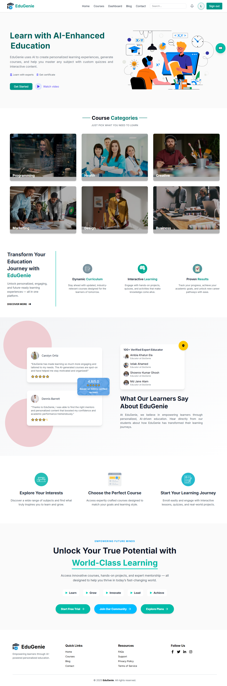

# EduGenie 🎓

**EduGenie** is an AI-powered educational platform built with **Next.js**, enabling educators to create personalized courses and students to access intelligent learning resources. The platform enhances the teaching and learning experience through automation, smart course generation, and real-time interactivity.

---

## 🌐 Live Demo

🔗 [Click here to visit EduGenie](https://genies-two.vercel.app/)

---

## 🚀 Features

✅ **Course Creation with Gemini AI API**  
✅ **Display All Generated Courses (Frontend + Backend Integration)**  
✅ **Blog Page with AI-Generated Content**  
✅ **AI Chatbot & User Profile Management**  
✅ **Role-Based Dashboard** (Educator & Student)  
✅ **Parallax & Animated Course Carousel with Filters**  
✅ **Real Testimonials with Stats and Orbit Animation**  
✅ **Email Contact Form with EmailJS Integration**

---

## 🧑‍💻 Tech Stack

- **Frontend**: Next.js (App Router), React, Tailwind CSS, ShadCN/UI, Framer Motion, React Slick
- **Backend**: Node.js, Express.js, MongoDB
- **AI Integration**: Gemini API
- **Email Service**: EmailJS
- **Authentication**: JWT / Role-Based Routing
- **Hosting**: Vercel (Frontend), Render / Railway (Backend)

---

## 📸 Screenshots

> *(Insert your screenshots here)*  
> Example:  
> 

---

## 📁 Folder Structure (Simplified)
EduGenie/
│
├── app/ # Next.js App directory
│ ├── dashboard/ # Role-based dashboards
│ ├── courses/ # AI-generated courses
│ ├── blog/ # Blog articles from backend
│ ├── chat/ # AI Chatbot
│ └── page.tsx # Main pages
│
├── components/ # Reusable UI components
├── hooks/ # Custom React hooks
├── lib/ # API utilities
├── public/ # Static assets
├── styles/ # Tailwind and custom styles
├── utils/ # Helper functions
├── .env.local # Environment variables
└── README.md

yaml
Copy
Edit

---

## ⚙️ How to Run Locally

### 1. Clone the Repository

```bash
git clone https://github.com/ela60/EduGenie-Educational-Platform.git
cd EduGenie-Educational-Platform
2. Install Dependencies
bash
Copy
Edit
npm install
3. Set Environment Variables
Create a .env.local file and add:

env
Copy
Edit
NEXT_PUBLIC_API_BASE_URL=http://localhost:5000
GEMINI_API_KEY=your_gemini_api_key
EMAILJS_SERVICE_ID=your_service_id
EMAILJS_TEMPLATE_ID=your_template_id
EMAILJS_PUBLIC_KEY=your_public_key
4. Run the Development Server
bash
Copy
Edit
npm run dev
Open http://localhost:3000 in your browser.

🧪 Testing
Coming soon...

---


- Add CI/CD badges (e.g., Vercel deploy status)?
- Automatically deploy GitHub updates to Vercel?
- Add extra projects to your portfolio section?

I'm here to help!


